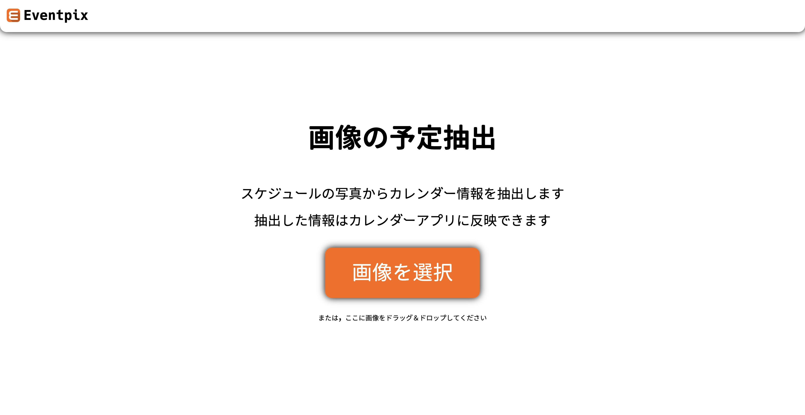

# eventpix

No Calendar No Life

# 使い方

## 前提

- Docker

## 準備

`.env.example`を参考に`.env`を作成．

## 実行

`compose.yml`があるディレクトリで次のコマンドを実行．

```
docker compose up --build
```

## 確認

http://localhost:8080 にアクセス


